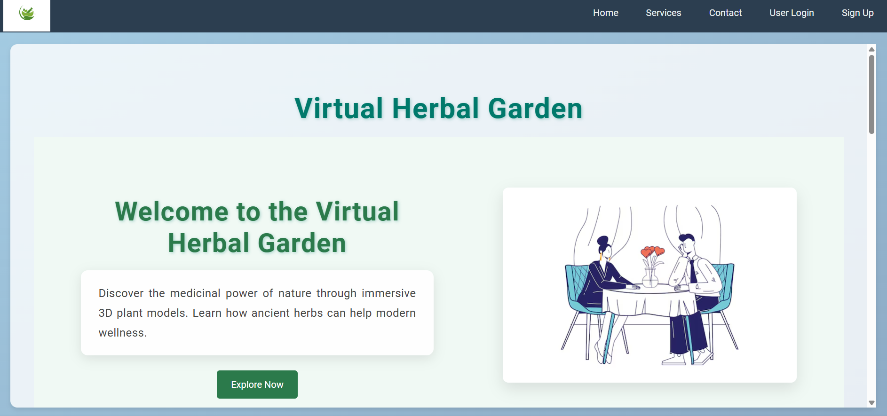
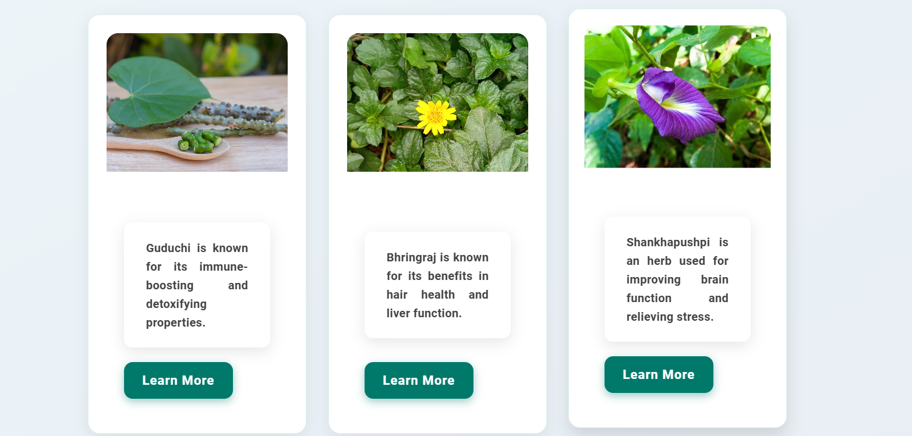
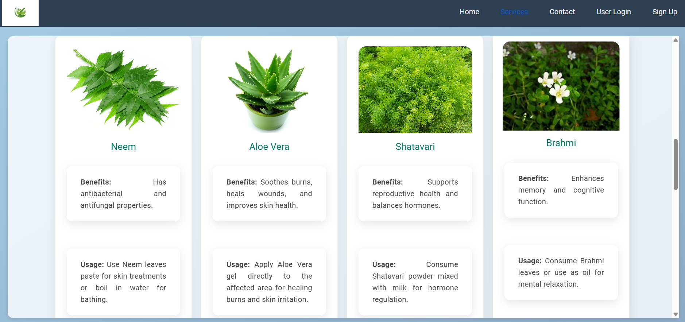
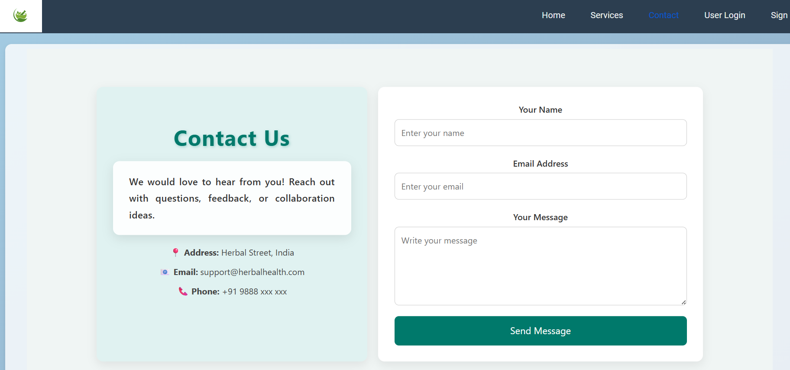
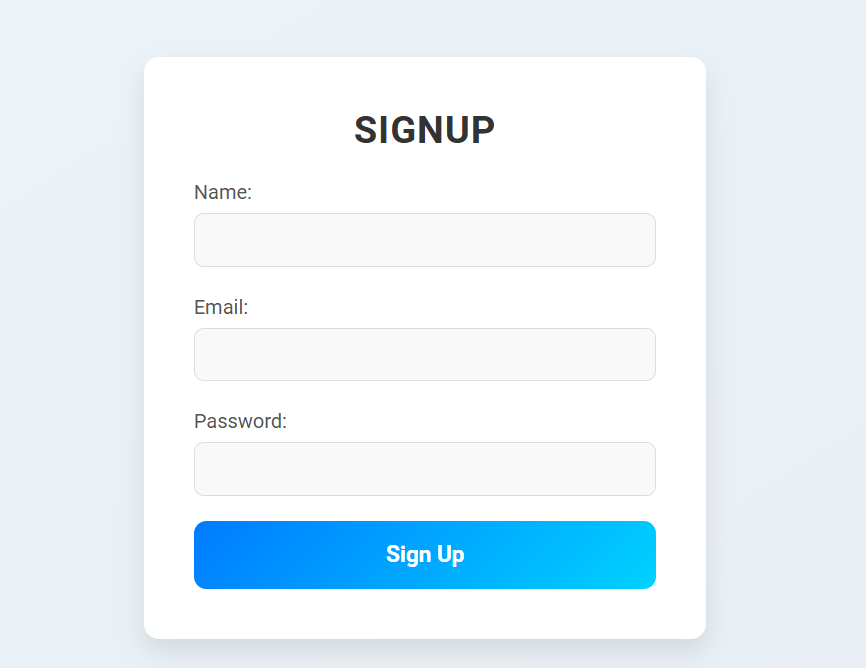
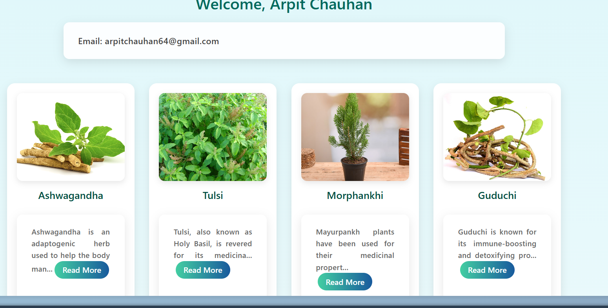
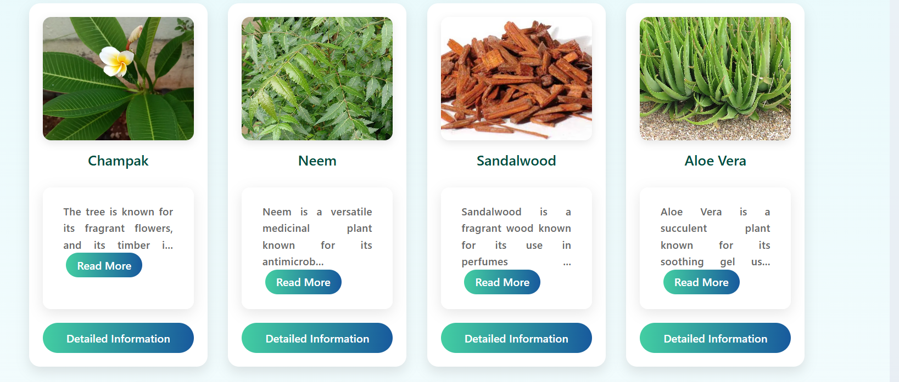
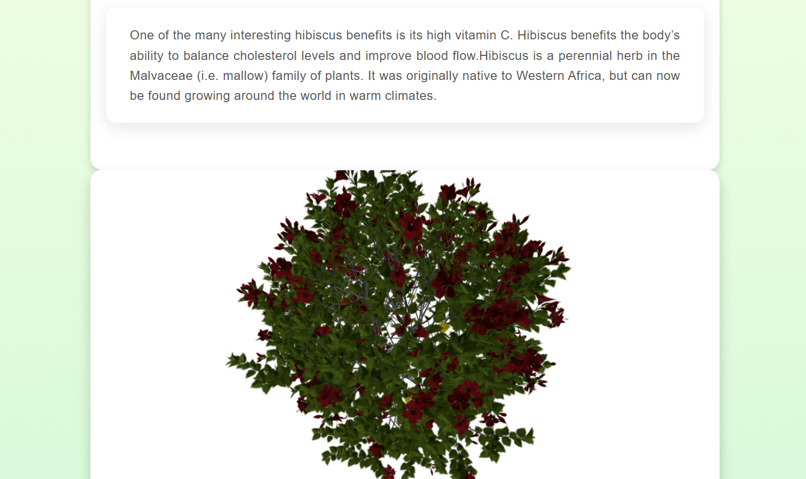

# React + Vite

This template provides a minimal setup to get React working in Vite with HMR and some ESLint rules.

Currently, two official plugins are available:

- [@vitejs/plugin-react](https://github.com/vitejs/vite-plugin-react/blob/main/packages/plugin-react/README.md) uses [Babel](https://babeljs.io/) for Fast Refresh
- [@vitejs/plugin-react-swc](https://github.com/vitejs/vite-plugin-react-swc) uses [SWC](https://swc.rs/) for Fast Refresh

## 📸 Screenshots

### Home Page

### Service Page

### Contact Page

### SignUp Page

### Dashboard

### 3D Model

## 🌿 Features

- 🔍 Detailed Plant Profiles
  Each plant includes its image, name, description, medicinal value, and usage methods.

- 🌀 3D Model Integration
  Realistic 3D models and 360° views using @react-three/fiber and three.js to provide an immersive experience.

- 📍 Interactive Hotspots
  Clickable markers on plant models that reveal specific plant part benefits and uses.

- 🧑‍💻 User Dashboard
  Displays personalized welcome message and a gallery of all available plants with quick access to detailed views.

- 📦 RESTful API Integration
  Backend powered by Node.js and Express.js connected to MongoDB to store and serve plant data dynamically.

- 🔐 Authentication System
  Secure user login, signup, and session-based access to dashboard features.

